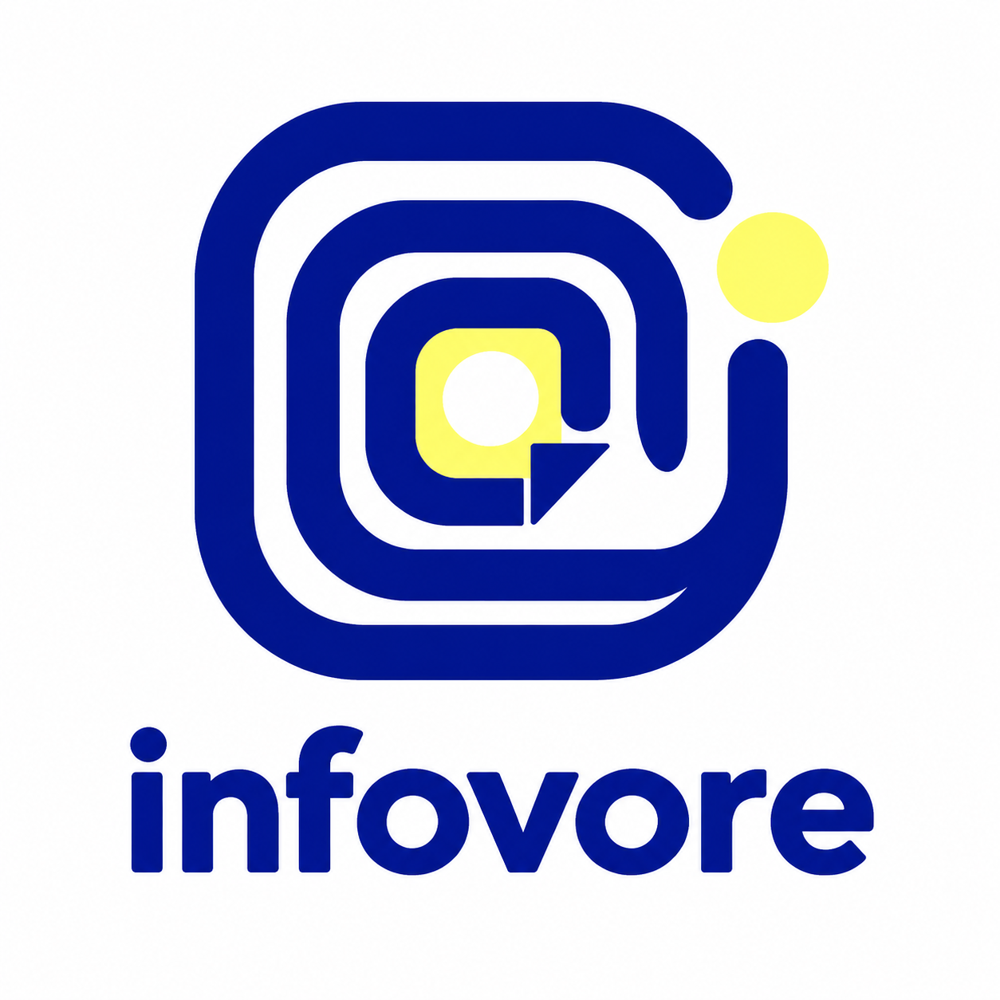

# infovore



A durable personal lifelog — aggregating what I play, watch, read, listen to,
and attend, with a public timeline, feeds, status cards, yearly Wrapped, and
an MCP endpoint for AI tools.
**[See the cards live →](https://infovore.skyhong.tw)**

<table>
  <tr>
    <td width="50%" valign="top"><a href="https://infovore.skyhong.tw"></a></td>
    <td width="50%" valign="top"><a href="https://infovore.skyhong.tw"></a></td>
  </tr>
  <tr>
    <td width="50%" valign="top"><a href="https://infovore.skyhong.tw"></a></td>
    <td width="50%" valign="top"><a href="https://infovore.skyhong.tw"></a></td>
  </tr>
  <tr>
    <td colspan="2" align="center"><a href="https://infovore.skyhong.tw"></a></td>
  </tr>
</table>

## Architecture

The data is the point — cards are just the first way to look at it. The code
is split into three layers so a new source or a new way of presenting the
data can be added independently:

```
sources/  ──fetch + normalize──▶  data/  ──read-only──▶  output/
(one file per platform)        (unified model, cache)    (one file per format)
```

- **`src/sources/`** — one module per platform. Each fetches/scrapes its
  source and normalizes the result into a `SourceSnapshot` (see below). All
  the platform-specific mess (HTML scraping, Anubis proof-of-work solving,
  OAuth, JSON:API quirks) is contained here and never leaks past this layer.
- **`src/data/`** — `types.ts` defines the snapshot and durable Activity v2
  models; SQLite stores last-good snapshots, sync runs, and the deduplicated
  activity timeline. The in-memory cache is restored from SQLite at startup,
  so an upstream outage or restart does not blank the site.
- **`src/output/`** — one module per rendered format. Today that's Satori
  SVG/PNG/WebP cards; each card reads only `SourceSnapshot` fields, never a
  source's raw shape.

The unified model (`src/data/types.ts`):

- **`MediaEntry`** — one normalized activity item: `source`, `kind` (game /
  anime / manga / movie / show / book / music / video / event), `title`, `image`, `status`,
  `activityAt`, `rating`, and a small `extra` bag for the long tail that
  doesn't generalize (platform/playtime, episode counts, author, ...).
- **`SourceSnapshot<TExtra>`** — one refresh cycle's worth of data for a
  source: `profile`, headline `stats` counters, the normalized `entries`,
  and a typed `extra` for whatever genuinely doesn't fit `entries`/`stats`
  (e.g. stats.fm's weekly top-albums/top-artists leaderboard has no
  per-item date, so it isn't an "entry").

**Adding a source**: add `src/sources/<name>.ts` exporting a
`fetch<Name>(): Promise<SourceSnapshot<...>>`, register it in the
`fetchers` map in `src/index.ts`. No output module needs to change.

**Adding an output**: add a module under `src/output/` that reads
`SourceSnapshot` and register it (in `src/index.ts`'s `cards` map, or its
own registry for a non-card output like a feed). No source module needs to
change.

## Sources

| Service | Method |
|---|---|
| Dayflow | macOS companion reads bundled MCP and pushes daily snapshots |
| [Backloggd](https://backloggd.com/u/skychopath/) | HTML scrape (no public API) |
| [Kitsu](https://kitsu.app/users/skyhong2002) | Official JSON:API |
| [stats.fm](https://stats.fm/skyhong2002) | Public API |
| [Simkl](https://simkl.com) | Official API (client ID + OAuth token via PIN flow) |
| [Goodreads](https://www.goodreads.com/user/show/160195773-skychopath) | Shelf RSS feeds + profile scrape |
| [YouTube](https://urtube.observe.tw/skyhong.tw) | Mirrored from [urtube](https://urtube.observe.tw)'s public per-handle summary (stats, top channels, topics, per-day time) |

## Cards

Twenty cards in total — combined and single-medium variants:
`dayflow` (computer activity and category time), `backloggd` (10 recent games), `kitsu` / `kitsu-anime` / `kitsu-manga`,
`statsfm` / `statsfm-albums` / `statsfm-artists`,
`simkl` / `simkl-shows` / `simkl-movies`, `goodreads`,
`youtube` / `youtube-channels` / `youtube-topics`,
`health` (latest 3 recorded days each of sleep, workouts and steps; no efficiency score or lifetime totals), `health-sleep` (14 recorded wake-up days),
`health-sleep-stages` (stage proportions and efficiency), `health-exercise`, `health-steps`.

Health cards use Taipei time and the official Health Connect logo. Missing
sleep stages remain unknown; efficiency is not a Garmin sleep score. Step
history shows the latest positive recorded days, not missing days as zero.
All five variants refresh together after Android sync, including direct embeds.

Each card is served as **svg** (vector), **png**, or **webp** — the previews
above use webp (≈10× smaller than the SVG), so this page loads fast.

## Endpoints

- `GET /` — recent entries from every source in one chronological timeline
- `GET /platforms` / `/platforms/{source}` — per-platform local mirror pages
- `GET /cards` — card gallery (responsive HTML)
- `GET /profile` — public cross-media profile
- `GET /now` — current media, upcoming events, and recent activity
- `GET /wrapped/{year}` — annual cross-media recap
- `GET /status` — service status overview (JSON)
- `GET /card/{name}.{svg,png,webp}` — a card; `?scale=1..3` for raster (default 2)
- `GET /api/{source}.json` — a source's normalized `SourceSnapshot` (raw cached data)
- `GET /api/health.json` — Health Connect's public-safe aggregate snapshot
- `GET /api/activities.json?limit=100` — persisted, deduplicated public activity timeline
- `GET /feed.json` / `GET /feed.xml` — JSON and RSS activity feeds
- `GET /api/wrapped/{year}.json` — machine-readable annual recap
- `POST /api/ingest/events` — authenticated private-ingest service (JSON)
- `GET /api/ingest/health-connect/status` — authenticated Android sync status
- `POST /api/ingest/health-connect` — authenticated private Health Connect batches
- `POST /api/ingest/youtube/capture` — dedicated-token Chrome viewing capture
- `GET /api/ingest/youtube/history/status` — private cross-device sync checkpoint
- `POST /api/ingest/youtube/history` — private Google My Activity event batches
- `POST /api/ingest/youtube/progress` — explicit history progress import
- `POST /mcp` — stateless MCP Streamable HTTP endpoint
- `GET /healthz` — freshness-aware health check (`healthy`, `degraded`, or `unhealthy`)

Embed a card anywhere with ``.

## macOS Dayflow sync

Dayflow on macOS is an additional push source, using its bundled MCP helper.
The companion refreshes recent days every 15 minutes and reconciles older dates
in the background. `/platforms/dayflow`, `/card/dayflow.*`, Home, Now, and
`/api/dayflow.json` show daily/category aggregates. Activity text and app names
stay private. Computer time is separate from media totals to avoid overlap.
Set a dedicated `DAYFLOW_TOKEN`; see [setup and sync semantics](scripts/DAYFLOW.md).

## Android Health Connect sync

The [`android/`](android/) companion app provides automatic read-only sync from
Android Health Connect, including data Garmin Connect writes there on Android
14+. Raw records remain in dedicated private SQLite tables and are never
included in the public timeline or feeds. `/platforms/health`,
`/card/health.*`, the homepage, time statistics, and `/api/health.json` expose
daily aggregates, recent workout summaries, and latest measurements. The health
page and JSON/MCP projection also publish sleep start/end times and normalized
sleep stages for the latest 30 recorded Taipei wake-up days, as requested for
the public sleep timeline. The page displays the latest 14 days on a shared
horizontal clock axis (8pm–12pm, extended for naps or outlying sessions), with
deep/light/REM/awake stages, recorded time asleep, and session sleep efficiency.
Missing or conflicting stages stay unknown and suppress efficiency; efficiency
is not Garmin's proprietary sleep score. This exposes sleep schedules publicly;
the `get_health_summary` MCP tool exposes the same safe projection. Record/device
identifiers, origins, notes, and raw heart-rate samples stay private. See
[`android/README.md`](android/README.md) for setup, permissions, and build steps.

## Run it yourself (Docker)

```sh
git clone https://github.com/skyhong2002/infovore.git
cd infovore
cp .env.example .env      # then edit .env with YOUR accounts
docker compose up -d --build
```

Open <http://localhost:3000>. That's it — no other services required.

The Compose setup mounts a named `infovore-data` volume at `/data`; activity
history survives image rebuilds and container replacement. For a non-Docker
run, `DATABASE_PATH` defaults to `./data/infovore.sqlite`.

Compose runs the public app and authenticated ingest boundary as separate
containers. They share only the SQLite WAL volume. Generate `INGEST_TOKEN`
with at least 32 random characters before enabling ingestion. The Traefik
overlay routes only `/api/ingest/*` to the write service.

Set only the sources you use via `SOURCES` in `.env` (e.g. `SOURCES=kitsu,statsfm`);
the rest are hidden. Every account id/username is an env var — see the comments
in `.env.example`, including how to get a Simkl client id + OAuth token.

YouTube tracking itself lives in [urtube](https://urtube.observe.tw): the
`youtube` source mirrors the public `/u/<handle>/summary.json` of
`URTUBE_HANDLE` (on `URTUBE_BASE_URL`) for the platform page, the cards and
the per-day time ledger. The urtube dashboard must be public. The legacy
import/capture endpoints below still exist but are no longer what the site
displays.

### Import YouTube history

Set `YOUTUBE_PRIVATE_DATA_KEY`, then import a Google Takeout archive locally:

```sh
npm run youtube:import -- /path/to/takeout.zip
```

The same parser is available through authenticated ingestion:

```sh
curl -X POST https://infovore.example/api/ingest/youtube/takeout \
  -H "Authorization: Bearer $INGEST_TOKEN" \
  -H "Content-Type: application/zip" \
  --data-binary @/path/to/takeout.zip
```

Imports are idempotent. Full watch events use aggregate-only visibility and
search queries are encrypted at rest; neither is exposed by the generic
timeline, feeds, or MCP tools. Configure the Google Data Portability OAuth
values for daily `myactivity.youtube` archive sync. Testing OAuth applications
require reauthorization every seven days. For local Compose, the OAuth callback
uses the ingest service at `http://localhost:3001`; production reverse proxies
route the same `/api/ingest/*` path on the public domain.

AI topic classification is disabled by default, even when AI credentials are
present. Set `AI_CLASSIFICATION_ENABLED=true` only for an intentional bootstrap
or classification run, then disable it again. Existing taxonomy and topic
assignments remain available while classification is disabled.

### Capture new YouTube viewing

Google Data Portability is not available for every account country. The
Manifest V3 extension in [`chrome-extension/`](chrome-extension/) is the
incremental fallback:

1. Generate a separate `YOUTUBE_CAPTURE_TOKEN` with at least 32 random
   characters. Do not reuse `INGEST_TOKEN`.
2. Open `chrome://extensions`, enable Developer mode, choose **Load unpacked**,
   and select this repository's `chrome-extension` directory.
3. Enter the capture token in the extension settings and test the connection.

The extension has three separate private inputs:

- Chrome playback capture starts after five non-ad playback seconds and sends
  cumulative measured watch time every 30 seconds.
- Daily account sync reads the signed-in Google My Activity YouTube page. This
  covers watches and searches performed on phones, TVs, and other devices using
  the same Google account. It runs when Chrome starts if the last successful
  sync is over 20 hours old, and checks hourly while Chrome remains open.
- YouTube History supplies recent resume positions and playback progress after
  each daily account sync. A manual full progress scan remains available.

Failed measured captures remain in `chrome.storage.local`, retry with bounded
exponential backoff, and survive browser restarts. Account sync overlaps its
checkpoint by two hours and the server deduplicates retries. Search terms are
sent only to the private ingest service over HTTPS and encrypted before storage.
The dedicated token can access only the capture, history, and progress
endpoints; cookies and unrelated browsing data are never collected.

The popup's **Sync now** action runs the same two-stage account-history and
recent-progress workflow immediately. **Full progress scan** opens the signed-in
YouTube History page and scans the entire available history for video ids,
resume/progress, and duration. Progress rows remain private and contribute only
aggregate content-coverage statistics. Automatic viewing capture does not
collect playback position, and non-Chrome playback time remains estimated
rather than measured.

### Behind a reverse proxy

For TLS + a custom domain via [Traefik](https://traefik.io) (e.g. a
[Dokploy](https://dokploy.com) stack sharing a `dokploy-network`), set `DOMAIN`
in `.env` (and optionally `LEGACY_DOMAIN` for an old domain that now CNAMEs
here, to keep both working during a migration) and add the overlay:

```sh
docker compose -f docker-compose.yml -f docker-compose.traefik.yml up -d --build
```

## Development

```sh
npm install
npm run dev   # http://localhost:3000
npm run check # typecheck + fixture/unit/integration tests
```

### Ingest an event

The endpoint accepts one manually recorded event or `{ "events": [...] }`.
Every event requires a public HTTPS image. A stable `id` lets later edits
(including `upcoming` → `attended`) update the same timeline entry. Free-form
`tags` are optional manual labels, not separate event types or sources. Ticket
QR codes, order numbers, seats, and payment data are not part of the schema.

```sh
curl -X POST https://infovore.example/api/ingest/events \
  -H "Authorization: Bearer $INGEST_TOKEN" \
  -H "Content-Type: application/json" \
  -d '{
    "title": "Concert",
    "startAt": "2026-08-01T19:30:00+08:00",
    "image": "https://example.com/concert-poster.webp",
    "tags": ["音樂會"],
    "venue": "Concert Hall",
    "url": "https://kktix.com/events/example",
    "status": "upcoming"
  }'
```

When `url` is a supported public OPENTIX, KKTIX, or Accupass event page, the
ingest service fills missing schema.org/Open Graph metadata. Other public HTTPS
URLs are saved as references without being fetched. It never signs in to a
ticket wallet.

### MCP

Connect a Streamable HTTP MCP client to `https://infovore.example/mcp`.
Available tools are `get_recent_activities`, `search_lifelog`,
`get_current_media`, `get_upcoming_events`, and `get_annual_summary`.

## Delivered roadmap

- Separate authenticated ingestion for private/event sources
- Public profile and `/now`
- RSS and paginated/filterable JSON feeds
- MCP Streamable HTTP server for AI agents
- Annual cross-media Wrapped

See [`TODO.md`](TODO.md) for the verified delivery checklist and deliberate
external-authorization boundaries.
